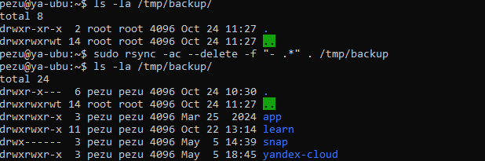

# Резервное копирование

## Задание №1

### cmd
```
rsync -ac --delete -f "- .*" . /tmp/backup
```
### result


## Задание №2

### Script
```
#!/bin/bash
sudo rsync -a --delete /home/pezu/ /tmp/backup

dateNow=$(date '+%Y-%m-%d')

if [ "$?" -eq 0 ]; then
    logger "${dateNow}. Backup home directory - create SUCCESSFULLY"
else    
    logger "${dateNow} Backup home directory - create FAILED"
fi
```
### CRON
```
0 * * * * /home/pezu/rsync.home.sh  2>&1 >/dev/null | logger -p user.error -t /home/pezu/rsync.home.sh
```
### result


## Задание №3*

### cmd
```
rsync -a --progress --bwlimit=1000 film.mp4 firegzhel@89.22.52.17:www/files
```
### result


